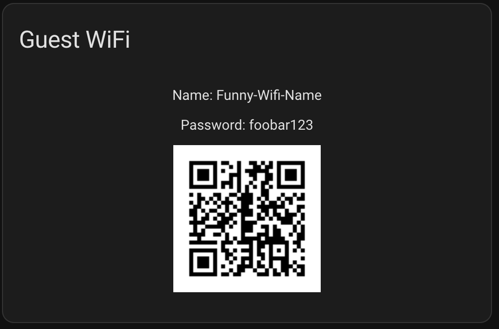

# Guest Wifi Card 

Just enter the SSID and the SSID of your GuestWifi and the
QR Code will be displayed. Very usefull for Dashboards

***

***

## Development
To create a new version which is useable in Home Assistant [Parcel](https://github.com/parcel-bundler/parcel#readme) is used.
Please do run `npm run build`. In the folder `dist/` a `card.js` and a `card.js.map` file appears if everything is successfull. These two files are the compiled version of this card.